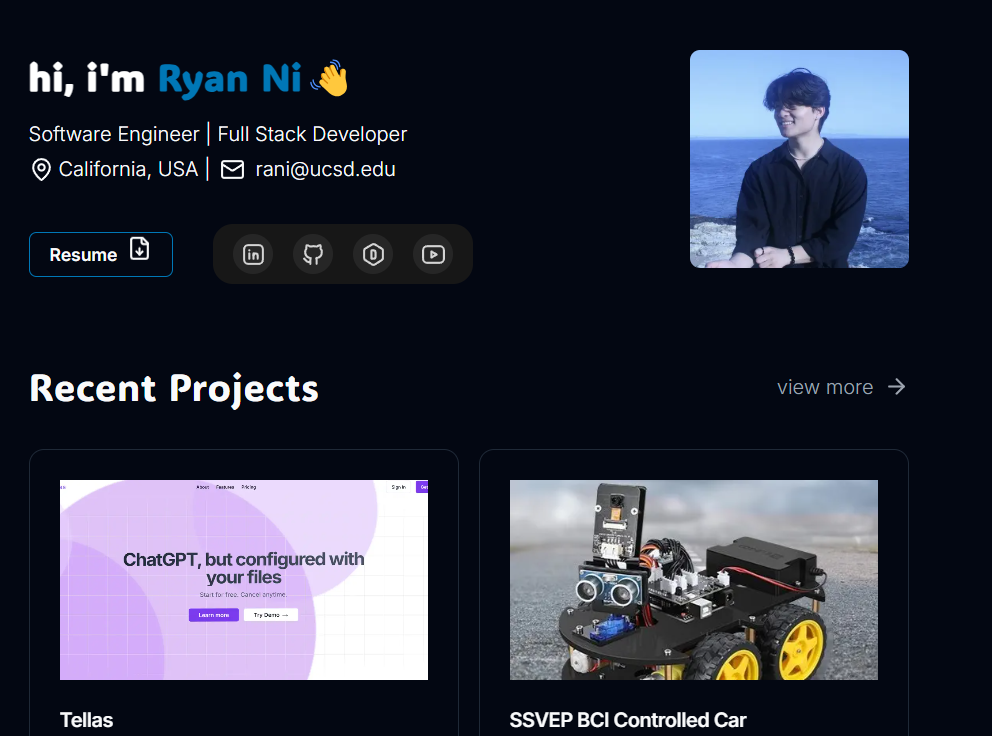
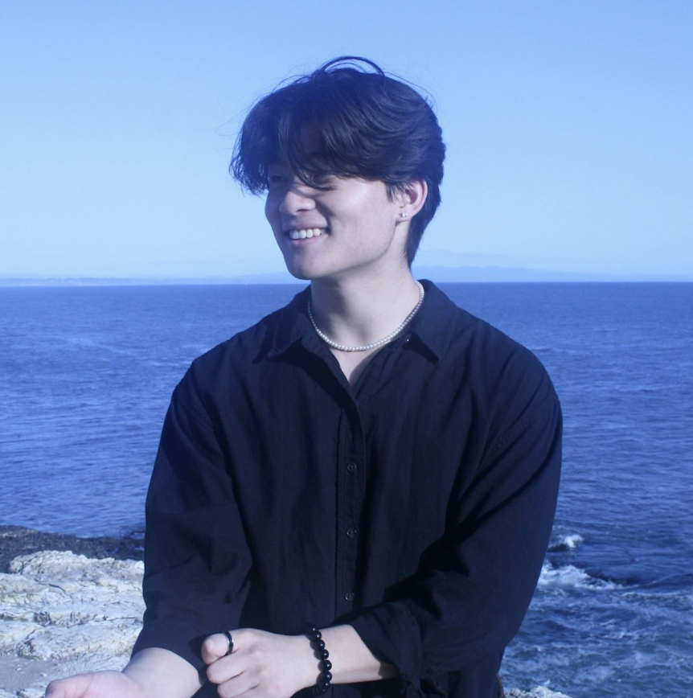

# hi, I'm **Ryan Ni** 👋  
> - but I also go by @ryunzz!

###
here are some pics!

[image of me](https://ryan-ni.vercel.app/ryan.jpg)

###

I've been told that `import openai` will always solve my problems

> _But when that fails, I try googling the error and crying into my keyboard._

## 🧠 About Me

- Student @ ucsd   

**Current Vibe:** _Running `npm start` and hoping for the best._  

### 💼 Things I've worked on On
1. cse100 final proj
2. cse101 final proj
3. personal projects

---

## 💻 Skills I Swear I Know™

- Python 🐍  
- C++ 
- Git (but only after I Google "git reset hard head origin")  
- Markdown, clearly 😎  

---

## 🚀 Projects

Here's some .md files
> ((*hopefully they still work*))

- [README](./README.md)  
- [index](./index.md)

---

## 🛠️ Things I'm Working On

- [x] taking cse110
- [ ] becoming a vibe coder 
- [ ] revamp my portfolio website

---

## 🔗 Here's some links!
- [My LinkedIn](https://www.linkedin.com/in/ryan-ni/)
- [Jump to About Me](#-about-me)

---

That's it for now :)

